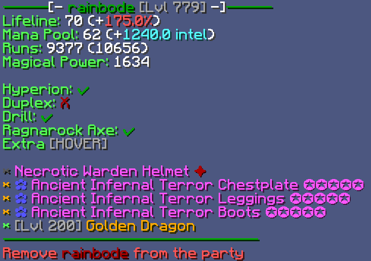
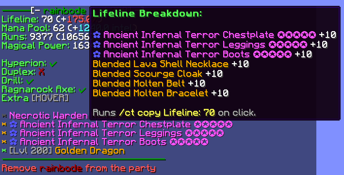
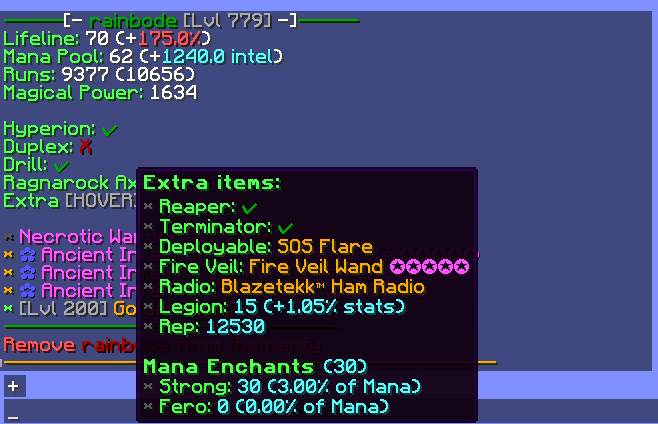
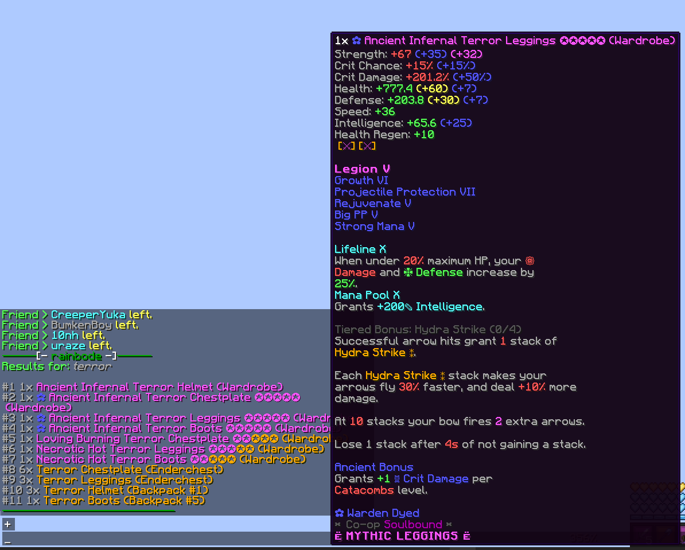
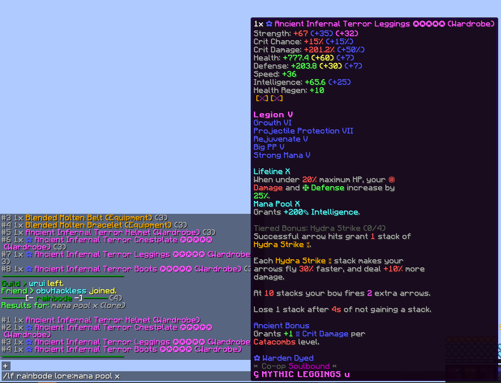
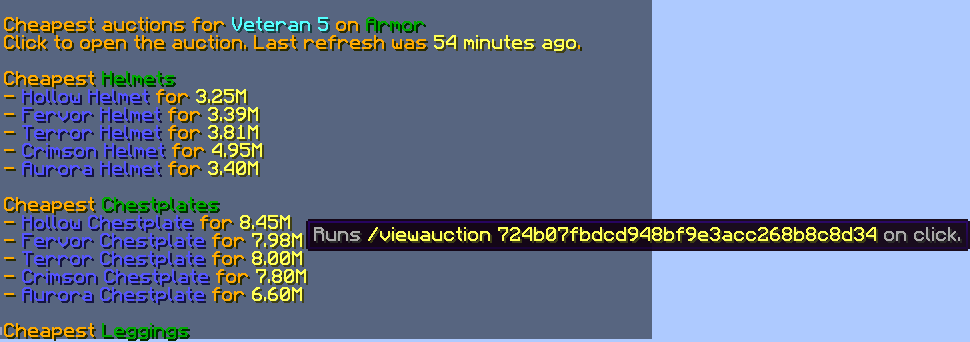
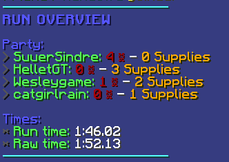
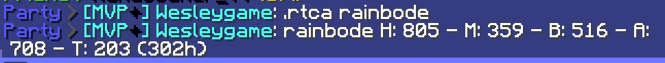

# KUUDRAISCOOL

Welcome to **kuudraiscool**, a CT module built mainly for kuudra, but also has other features.
- [] = optional
- <> = required

## Kuudra info (Stats & Items)

- `/kuudra <PLAYER>`
- `Party finder information` 
  
 
 

  

## Item finder
- `/lf <PLAYER> <NAME>`
- `/lf <PLAYER> lore:<LORE>`
  

## Attribute price checker (Similar to KG bot)

- `/attributeprice <ATTRIBUTE> [LEVEL] <ATTRIBUTE> [LEVEL]`
- `/ap <ATTRIBUTE> [LEVEL] <ATTRIBUTE> [LEVEL]`
  

  

## Run overview

- `An overview of the kuudra run`
  

  

## Chat commands:

- `.stats [PLAYER]`
  

  
- `.runs [PLAYER]`
  

  
- `.rtca [PLAYER]`
  

  

## Other

- ### `/apikey <KEY>`
    >Sets the API key for the mod to use our custom API. Note: This is not Hypixel's API key.

- ### `/kuudraiscool` (`/kic`)
    >The main command to open the GUI where you can toggle features and set the API key.

- ### `/t1 - /t5`
    >Join Kuudra tiers easily. `/t1` represents tier 1 Kuudra, and `/t5` represents tier 5 Kuudra.

