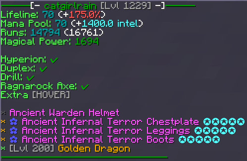

# kuudraiscool

Welcome to **kuudraiscool**, a CT module built mainly for Kuudra, but with additional features to enhance your gameplay experience.

---

## Features

### Kuudra-Related Features

- 

    
Kuudra Info (Stats & Items)

    <b>Command:</b> <code>/kuudra &lt;PLAYER&gt;</code>   
    Displays party finder information for a specified player.   
       
       
       

- 

    
Attribute Price Checker

    <b>Command:</b> <code>/ap &lt;ATTRIBUTE&gt; [LEVEL] [ATTRIBUTE] [LEVEL]</code>   
    Checks the price of specified attributes (similar to KG bot).   
       

- 

    
Attribute Price Auction

    <b>Command:</b> <code>/ka &lt;ATTRIBUTE&gt; [LEVEL] [ATTRIBUTE] [LEVEL]</code>   
    Displays a custom auction house of items for specific attributes. 
       
       
       
       
       

- 

    
Run Overview

    A detailed overview of your kuudra run.   
       

- 

    
Chest Profit Calculator

    <b>Commands:</b>    
    <code>/kuudraprofit edit</code>   
    <code>/kuudraprofit reset</code>   
    Calculates and displays profits of a paid chest.   
       

- 

    
Profit Tracker

    <b>Commands:</b>    
    <code>/kuudraprofittracker edit</code>   
    <code>/kuudraprofittracker reset</code>   
    <code>/kicresetprofittracker</code>   
    Tracks overall profits from your runs.   
       

- 

    
Reroll Notifier

    <b>Commands:</b>    
    <code>/kuudrarerollnotifier edit</code>   
    <code>/kuudrarerollnotifier reset</code>   
    Notifies you when you should reroll a paid chest.   
       

- 

    
Auto Kick

    Automatically kicks players based on specific criteria set in the settings.   
       

- 

    
Auto Open Paid Chest

    Automatically opens paid chests.   
       

- 

    
Auto Reroll Paid Chest

    Automatically rerolls paid chests.   
       

### Other Features

- 

    
Item Finder

    Finds specific items in your inventory or elsewhere.   
       
       

- 

    
Chat Commands

    

        
Party Chat

        - <code>.runs [player]</code>   
             
        - <code>.stats [player]</code>   
             
        - <code>.rtca [player]</code>   
           
        - <code>.ap &lt;attribute&gt; [level]</code>   
             
        - <code>.kick &lt;player&gt;</code>   
             
        - <code>.cata [player]</code>   
             
        - <code>.kic</code>   
             
    

    

        
Direct Messages

        - <code>.runs [player]</code>   
             
        - <code>.stats [player]</code>   
             
        - <code>.rtca [player]</code>   
           
        - <code>.ap &lt;attribute&gt; [level]</code>   
             
        - <code>.kic</code>   
             
    

- 

    
MVP++ Emojis

    Allows usage of MVP++ emojis in chat.   
       

- **`[ ]` = optional**
- **`< >` = required**

---

## Commands

### General Commands

- `/cancelrunoverview`
- `/runoverviewpreview`
- `/kicresetprofittracker`
- `/addprofit <profit>`
- `/doogans`
- `/apikey <key>`
- `/t1 - /t2 - /t3 - /t4 - /t5`
- `/lf <player> <query>`
- `/lf <player> lore:<query>`
- `/attributeprice <attribute> [level] [attribute] [level]` (Alias: `/ap`)
- `/kicauction <attribute> [level] [attribute] [level]` (Alias: `/ka`)
- `/kuudra [player]`

### KIC Commands

- `/kic`
- `/kic help`
- `/kic apikey <key>`
- `/kic checkapikey`
- `/kic t1 - t2 - t3 - t4 - t5`
- `/kic settings`
- `/kic customize`
